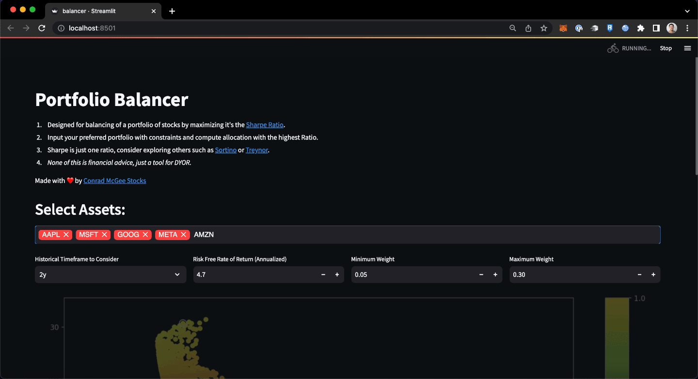

  

# Portfolio Balancer
A Streamlit App to balance a portfolio of stocks by maximizing its Sharpe Ratio plus a Monte Carlo simulation to help visualize the efficeny curve. It's worth noting that it simply balances the portfolio to maximize it's Sharpe Ratio, there are other interesting ratios to explore like the Sortino or Treynor Ratio.

### Installation:
Install dependencies with pip, (vitrualenv recommended):

`pip install -r requirements.txt`

### Usage:
Run the script with Streamlit:

`streamlit run src/portfolio_balancer.py`

This will launch a Streamlit app that allows you to select the assets you want to include in your portfolio, set the historical timeframe to consider, and specify the risk-free rate of return, minimum weight, and maximum weight.

## Disclaimer
If it isn't abundently clear... I am not a financial advisor. This script is not financial advice and should not be used as such. It is simply a tool I've used to build a perspective. Consult with a financial advisor before making any investment decisions. 

